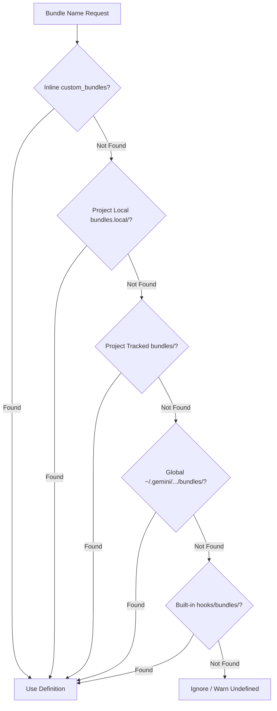

# Permission Bundles Architecture & Scoped Directory Layout

Permission Bundles provide curated, reusable sets of static ACL rules, semantic guidelines, and skill whitelists that can be activated across Session, Project, or Global scopes.

---

## 1. Directory Layout & Scoped Encapsulation

To avoid polluting the root `.agents/` directory and prevent naming collisions with other tools, `auto-permissions` organizes configuration files within dedicated subdirectories:

```text
<workspace>/
├── .agents/
│   └── auto-permissions/
│       ├── config.json               # Tracked repository policy & active bundles
│       ├── config.local.json         # Git-ignored local developer overrides
│       ├── bundles/                  # Repository-shared custom bundle definitions
│       │   └── internal_ci.json
│       └── bundles.local/            # Local-only custom bundle definitions
│           └── debug_tools.json
```

### Dual-Resolution & Backward Compatibility
The resolution helper (`get_scope_file_candidates`) searches for configuration files using a dual-resolution hierarchy:
1. **Primary Path:** `.agents/auto-permissions/config.json`
2. **Legacy Fallback:** `.agents/auto-permissions.json`

Existing projects continue to function with zero configuration changes, and can be upgraded at any time via `configure_permissions.py --migrate-layout`.

---

## 2. Bundle Lookup Hierarchy

When a bundle name (e.g. `git-inspect` or `company-ci`) is declared in a policy file, the engine resolves definitions in the following order:



---

## 3. DAG Inheritance (`extends`) & Cycle Detection

Bundles can inherit and extend rules from other bundles via the `extends` property:

```json
{
  "$schema": "https://json-schema.org/draft/2020-12/schema",
  "name": "full-stack-dev",
  "description": "Full stack tooling bundle",
  "extends": ["python-tooling", "node-tooling", "git-inspect"],
  "allow": [
    "command(docker compose up*)",
    "command(docker compose down*)"
  ]
}
```

The expansion engine (`expand_bundle_hierarchy`):
- Resolves transitive dependencies recursively in Topological Depth-First order.
- Tracks `visiting` and `visited` sets to detect and safely short-circuit circular inheritance cycles (`A -> B -> A`).
- Maps rule provenance (`provenance[rule] = "bundle:<slug>"`), enabling clear attribution during security gate evaluation.

---

## 4. Scope Override & Masking Contracts

Higher scopes can disable or mask bundles inherited from lower scopes using the object dictionary syntax:

```json
{
  "bundles": {
    "enabled": ["git-inspect"],
    "disabled": ["python-tooling"]
  }
}
```

If `python-tooling` was enabled in Global or Project scope, the Session override completely excludes its rules from the static evaluation table.
