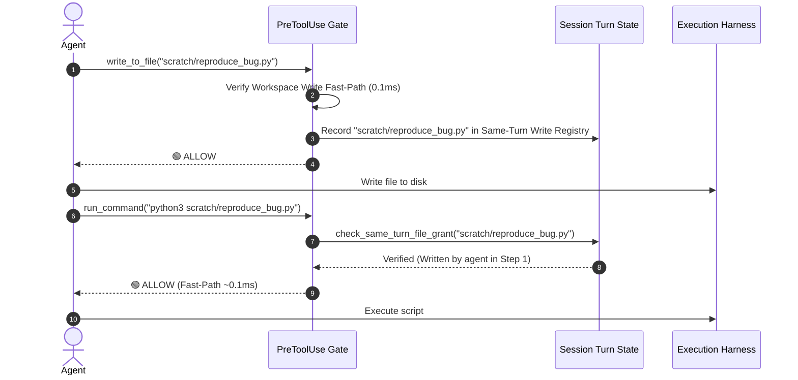

# Same-Turn File Grants & Scratch Acceleration

When an AI agent works on a complex coding task, it frequently authors temporary test scripts, mock runners, or reproduction harnesses in workspace scratch directories (e.g. `scratch/test_repro.py`, `tests/test_new_feature.py`), and immediately invokes them with `python3` or `pytest`.

Without same-turn awareness, every newly created file invocation would require a separate 1.4s remote classifier roundtrip.

---

## 1. Mechanism & Lifecycle

`hooks/policy_engine.py` implements the `check_same_turn_file_grant` helper:

---

## 2. Security Boundaries & Invariants

1. **Turn-Scoped Ephemerality:** Same-turn file grants expire immediately when the active turn concludes (`stepIdx` reset or turn boundary).
2. **Workspace Path Containment:** Same-turn grants are strictly restricted to non-sensitive paths located within workspace roots.
3. **Sensitive Path Exclusion:** Writes to sensitive paths (`.git/`, `.ssh/`, `.env`, `.agents/auto-permissions/`) are permanently excluded from same-turn execution grants and require explicit classification or confirmation.
