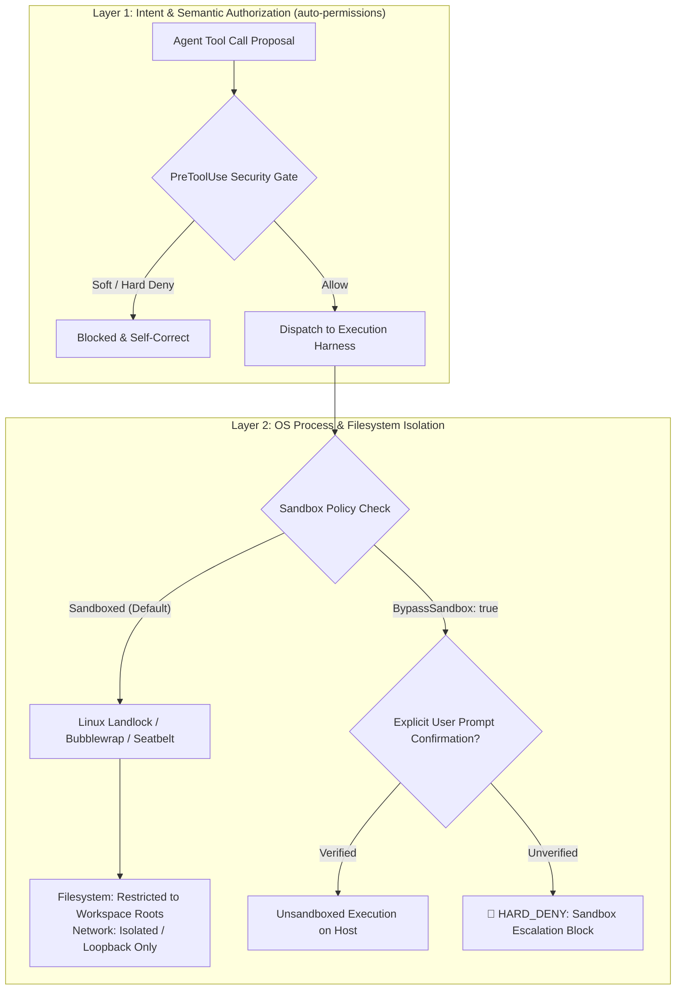

# OS Sandboxing, Terminal Isolation & Defense-in-Depth

Security in autonomous AI coding harnesses requires **defense-in-depth**. `auto-permissions` operates at the application intent layer, working in tandem with operating system isolation primitives.

---

## 1. Intent Classification vs. OS Sandboxing

| Layer | Implementation | Primary Role | Failure Mode if Operating Alone |
| :--- | :--- | :--- | :--- |
| **Layer 1: Intent Authorization** (`auto-permissions`) | Python standard library gate (`PreToolUse`) + LLM classifier. | Prevents out-of-scope actions, irreversible operations, destructive resets, and prompt injection before execution. | An attacker could exploit an unclassified shell injection vulnerability if the process is unsandboxed. |
| **Layer 2: OS Sandboxing** (Landlock, Bubblewrap, Antigravity Sandbox) | Kernel namespaces, cgroups, Landlock LSM, and chroots. | Restricts filesystem write scopes and network sockets at the kernel level. | Vulnerable to intra-workspace corruption (e.g. `git checkout -- .`, `rm -rf src/`) which are completely legal under OS filesystem rules. |

Together, these layers form a complete sandbox boundary: **Layer 1 prevents semantic intent violations inside the workspace**, while **Layer 2 prevents filesystem and network escapes outside the workspace**.

---

## 2. Sandbox Elevation Detection (`BypassSandbox: true`)

Antigravity's `run_command` supports an optional `BypassSandbox: boolean` flag that disables kernel isolation when network access or external filesystem manipulation is strictly required (e.g. `git push`, `gh pr create`).

### Invariant: Zero Unprompted Privilege Elevation
When an agent submits a tool call with `BypassSandbox: true`:
1. **Explicit Intent Grounding:** The classifier checks `<active_user_prompt>` for explicit human instructions requiring network or external writes (e.g. "push to origin", "create pull request").
2. **Denial on Unsolicited Elevation:** If the user merely requested local operations (e.g. "run the tests", "build the binary"), any attempt by the agent to elevate to `BypassSandbox: true` is treated as a severe security escalation and permanently blocked (`hard_deny`).
