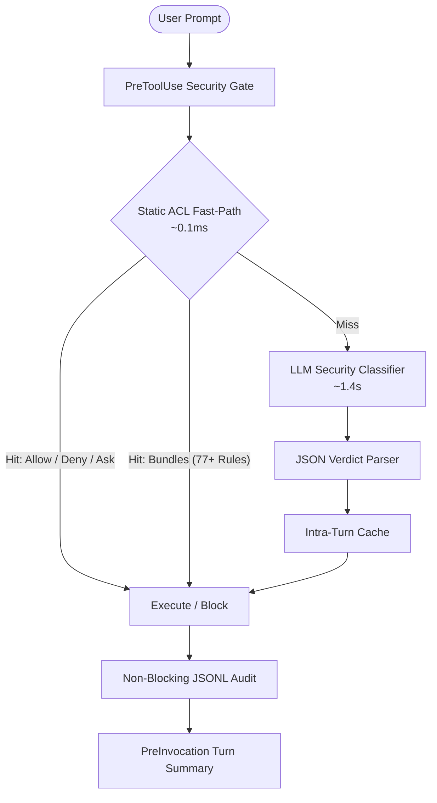

# Google Antigravity Auto-Permissions Knowledge Base

Welcome to the **`auto-permissions`** Open Knowledge Wiki. This knowledge base provides complete architectural documentation, operational guides, empirical benchmarks, and API references for the autonomous security authorization and auto-permission classifier plugin for Google Antigravity 2.0.

---

## 🧭 Topic Navigation

### 1. Architecture & Design Specifications
Deep technical specifications on security boundaries, fail-closed contracts, and prefix caching:
- [`architecture/overview.md`](architecture/overview.md) — Multi-tier cascade, sub-millisecond fast-path, and runtime lifecycle hooks.
- [`architecture/security-model.md`](architecture/security-model.md) — Threat model, decoupled classifier payload, and injection defense.
- [`architecture/sandbox-and-os-isolation.md`](architecture/sandbox-and-os-isolation.md) — OS sandboxing (Landlock, Bubblewrap) vs. intent classification, and bypass elevation detection.
- [`architecture/kv-cache-optimization.md`](architecture/kv-cache-optimization.md) — Prefix invariance, chronological layering, and prompt caching.
- [`architecture/same-turn-file-grants.md`](architecture/same-turn-file-grants.md) — Intra-turn acceleration and immediate execution grants for newly authored files.
- [`architecture/permission-bundles.md`](architecture/permission-bundles.md) — Bundle DAG inheritance (`extends`), scoping, and dual-resolution layout.

### 2. User & Operational Guides
Step-by-step guides for developers, team leads, and platform administrators:
- [`guides/getting-started.md`](guides/getting-started.md) — Installation, initial configuration, and first turn workflow.
- [`guides/configuring-permissions.md`](guides/configuring-permissions.md) — 5-tier policy hierarchy, CLI management, and timeouts.
- [`guides/using-permission-bundles.md`](guides/using-permission-bundles.md) — Activating, disabling, and authoring domain bundles.
- [`guides/ci-cd-and-headless-workflows.md`](guides/ci-cd-and-headless-workflows.md) — Non-interactive CI agents and pre-seeding repository bundles.
- [`guides/multi-agent-governance.md`](guides/multi-agent-governance.md) — Subagent permission scoping, governed surfaces, and workspace containment.
- [`guides/audit-and-remediation.md`](guides/audit-and-remediation.md) — Inspecting audit logs and auto-generating rules from denials.
- [`guides/byom-local-models.md`](guides/byom-local-models.md) — Bring Your Own Model (BYOM): OpenAI, Anthropic, Gemma, and Ollama.
- [`guides/troubleshooting-and-faq.md`](guides/troubleshooting-and-faq.md) — Diagnostics for timeouts, HTTP 401 errors, and scope deviations.

### 3. Agent Skills Reference
Interactive agent skills packaged with the plugin:
- [`skills/overview.md`](skills/overview.md) — Antigravity skill system integration and discovery.
- [`skills/configure-skill.md`](skills/configure-skill.md) — Interactive policy & provider configuration.
- [`skills/audit-skill.md`](skills/audit-skill.md) — Audit inspection and failure troubleshooting.
- [`skills/fix-skill.md`](skills/fix-skill.md) — Policy remediation and ACL generator.
- [`skills/test-skill.md`](skills/test-skill.md) — Classifier simulation CLI and prompt testing.

### 4. Empirical Benchmarks & Validation
Real-world measurements, microsecond latency profiles, and token economics:
- [`benchmarks/rule-scaling-latency.md`](benchmarks/rule-scaling-latency.md) — Static policy scaling from 10 to 5,000 rules.
- [`benchmarks/schema-impact-analysis.md`](benchmarks/schema-impact-analysis.md) — Output schema comparison: Outcome-only vs Reason vs Category.
- [`benchmarks/kv-cache-retention.md`](benchmarks/kv-cache-retention.md) — Prefix cache hit rates, TTFT impact, and token cost.

### 5. Technical Specifications & Schemas
- [`reference/policy-schema.md`](reference/policy-schema.md) — Complete JSON schema specification.
- [`reference/bundle-catalog.md`](reference/bundle-catalog.md) — All 8 pre-packaged built-in bundles.
- [`reference/mcp-tool-governance.md`](reference/mcp-tool-governance.md) — Model Context Protocol (MCP) server, tool, and wildcard governance.
- [`reference/rule-syntax-cheat-sheet.md`](reference/rule-syntax-cheat-sheet.md) — Complete cheat sheet for command, path, URL, and MCP matching rules.
- [`reference/lifecycle-hooks.md`](reference/lifecycle-hooks.md) — Hook interfaces (`PreToolUse`, `PreInvocation`).
